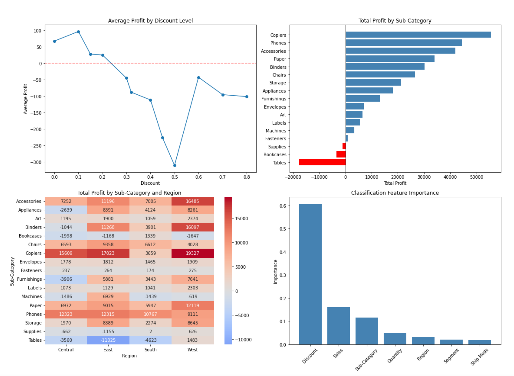

# Superstore Profitability Analysis

Exploratory data analysis and binary classification on the Sample Superstore dataset.

## Main Findings

- Discount is the single strongest driver of unprofitability (feature importance: 0.60)
- Tables and Bookcases generate negative total profit regardless of region
- The Central region underperforms across multiple product categories
- Shipping time has no meaningful effect on profit
- A Random Forest classifier predicts order profitability with 94% accuracy

## Overview

| Stage | Methods |
|---|---|
| EDA | Correlation analysis, categorical impact scoring, time series |
| Geography | State and city-level profit and loss rate breakdown |
| Classification | Random Forest, confusion matrix, feature importance |

## Results

## Stack

Python, pandas, scikit-learn, seaborn, matplotlib
